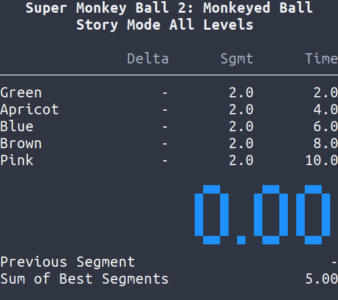

# Flitter

A speedrunning / split timer for the terminal.



## Features

- Global hotkeys
- :rainbow: Animated rainbow best splits
- 24-bit terminal color
- Undo / delete split
- Pause / resume
- Splits and history stored in single human-editable file
- 60 FPS rendering with low CPU usage
- Robust time computations: float math is mostly avoided

## Install

Flitter has been tested on Linux, but in theory it should work on MacOS as well. Windows is not supported.

### OCaml Dependencies

Flitter is mostly written in OCaml.

Install opam: [opam install instructions](https://opam.ocaml.org/doc/Install.html)

Set up opam and install OCaml dependencies:

```bash
$ opam init
$ opam switch 4.07.0
$ opam install dune core lwt re color sexp_pretty
```

### Python Dependencies

Flitter uses a tiny amount of Python to provide global hotkeys.

Install pip for Python 3. For example, on Ubuntu / Debian:

```bash
$ sudo apt install python3-pip
```

Install Python package dependencies:

```bash
$ pip3 install --user pynput
```

### Install Flitter

```bash
$ git clone --recursive https://github.com/alexozer/flitter.git
$ cd flitter
$ dune build
$ dune install
```

## Usage

Create your splits:

Copy `examples/splits.scm` somewhere. Edit it and add your game and split information. The personal best splits, world record splits, and gold segments are not required.

Launch Flitter with your splits file:

```bash
$ flitter my-splits.scm
```

**Warning:** Don't edit your splits file while Flitter is running, your changes will be overwritten.

### Keybindings

Keybindings are all global hotkeys; they will work even when the terminal is not focused.

| Keys        | Action                                              |
| ----------- | --------------------------------------------------- |
| `Space`     | Start / split / save and reset if run finished      |
| `J`         | Start / split                                       |
| `K`         | Undo split                                          |
| `D`         | Delete last segment                                 |
| `Backspace` | Pause / reset (save run if finished and save golds) |
| `Delete`    | Pause / delete run (don't save anything)            |
| `Q`         | Quit (if not currently timing)                      |

## Contributing

Feel free to make an issue or a pull request!
